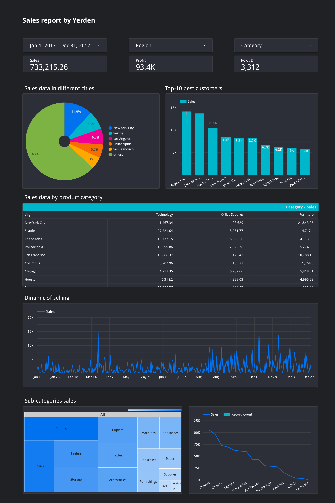

# Data-visualization Projects
## Following are my projects in Looker Studio, Tableau, Power BI, Python, Excel:  

- [x] **Looker Studio** - 
  - Super store sales Data Analysis Project 
*See on Looker Studio:* **[Sales report by Yerden](https://lookerstudio.google.com/s/hAeaBv3oqP4)**   
*NOTE: this report only works with data that is already in the excel file(Superstore)*

- [x] **Tableau** - 

*To view these Tableau Dashboards in Tableau Public, click on the hypertext link.*
- Sales in USA Dashboard: https://public.tableau.com/shared/5FH5QDXP6?:display_count=n&:origin=viz_share_link
*NOTE: this report only works with data that is already in the excel file(Superstore)*

